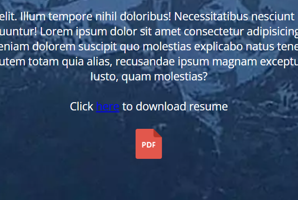

https://pryanbark.netlify.app/

https://github.com/pryanbark/t1a2

Purpose: to design a website that showcases my abilities as a coder.

Functionality/features: A navbar was included at the top of all pages for easy navigation around my portfolio. A brief, shorter version of my resume was included in the Work History tab. However I also included a download link for my full resume. A list of my previous projects were outlined in the Portfolio tab. Pictures and links to my blog were included in the Blog tab. My email, Github and Linkedin account were either listed or linked in my Contact tab. A contact form was also included in the Contact tab.

Sitemap:

Screenshots:

Target audience: Potential employers that would like to see what I can offer in terms of coding ability.

Tech stack: HTML, CSS